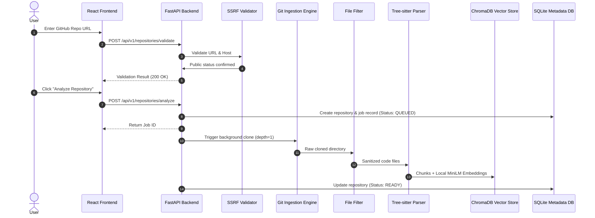
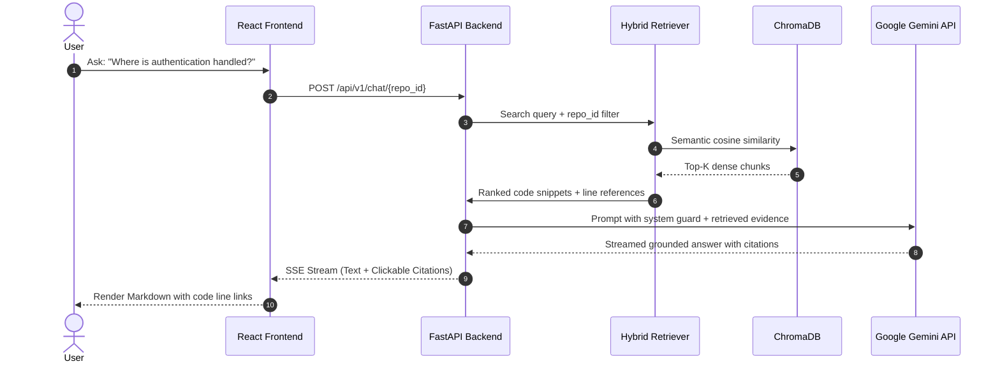

# Data Flow Specification

## Ingestion Data Flow

```mermaid
sequenceDiagram
    autonumber
    actor User
    participant Frontend as React Frontend
    participant API as FastAPI Backend
    participant Validator as SSRF Validator
    participant Cloner as Git Ingestion Engine
    participant Filter as File Filter
    participant Parser as Tree-sitter Parser
    participant Chroma as ChromaDB Vector Store
    participant SQLite as SQLite Metadata DB

    User->>Frontend: Enter GitHub Repo URL
    Frontend->>API: POST /api/v1/repositories/validate
    API->>Validator: Validate URL & Host
    Validator->>API: Public status confirmed
    API-->>Frontend: Validation Result (200 OK)
    
    User->>Frontend: Click "Analyze Repository"
    Frontend->>API: POST /api/v1/repositories/analyze
    API->>SQLite: Create repository & job record (Status: QUEUED)
    API-->>Frontend: Return Job ID
    
    API->>Cloner: Trigger background clone (depth=1)
    Cloner->>Filter: Raw cloned directory
    Filter->>Parser: Sanitized code files
    Parser->>Chroma: Chunks + Local MiniLM Embeddings
    API->>SQLite: Update repository (Status: READY)
```

## Query & Grounded Chat Data Flow

```mermaid
sequenceDiagram
    autonumber
    actor User
    participant Frontend as React Frontend
    participant API as FastAPI Backend
    participant Hybrid as Hybrid Retriever
    participant Chroma as ChromaDB
    participant Gemini as Google Gemini API

    User->>Frontend: Ask: "Where is authentication handled?"
    Frontend->>API: POST /api/v1/chat/{repo_id}
    API->>Hybrid: Search query + repo_id filter
    Hybrid->>Chroma: Semantic cosine similarity
    Chroma-->>Hybrid: Top-K dense chunks
    Hybrid->>API: Ranked code snippets + line references
    API->>Gemini: Prompt with system guard + retrieved evidence
    Gemini-->>API: Streamed grounded answer with citations
    API-->>Frontend: SSE Stream (Text + Clickable Citations)
    Frontend-->>User: Render Markdown with code line links
```
