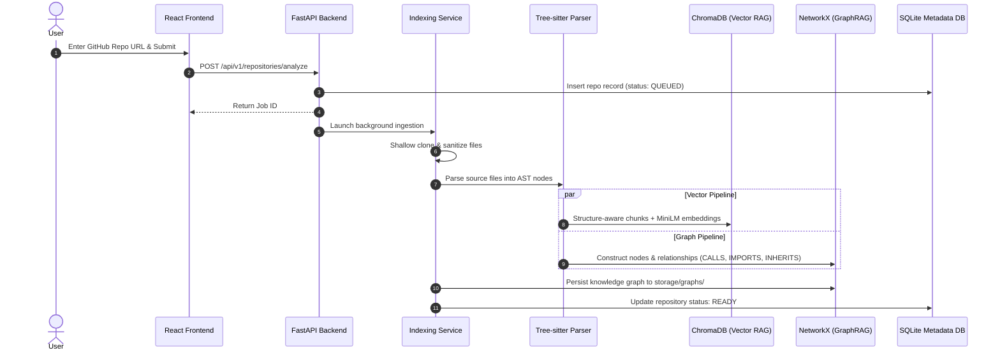
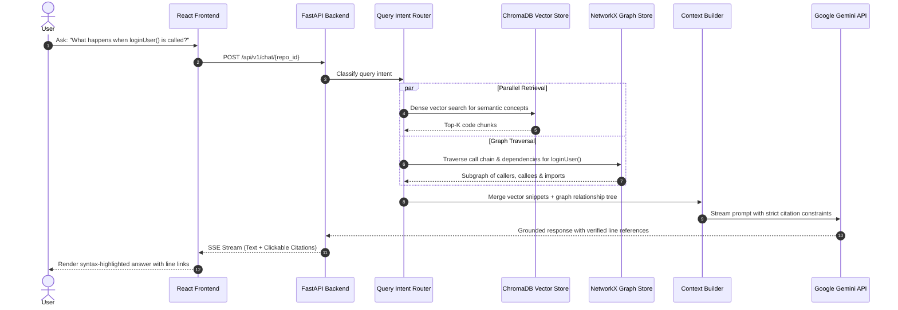

# Data Flow Specification: Hybrid Vector RAG + GraphRAG

## 1. Dual Ingestion & Indexing Flow

```mermaid
sequenceDiagram
    autonumber
    actor User
    participant Frontend as React Frontend
    participant API as FastAPI Backend
    participant Worker as Indexing Service
    participant TreeSitter as Tree-sitter Parser
    participant Chroma as ChromaDB (Vector RAG)
    participant Graph as NetworkX (GraphRAG)
    participant SQLite as SQLite Metadata DB

    User->>Frontend: Enter GitHub Repo URL & Submit
    Frontend->>API: POST /api/v1/repositories/analyze
    API->>SQLite: Insert repo record (status: QUEUED)
    API-->>Frontend: Return Job ID
    
    API->>Worker: Launch background ingestion
    Worker->>Worker: Shallow clone & sanitize files
    Worker->>TreeSitter: Parse source files into AST nodes
    
    par Vector Pipeline
        TreeSitter->>Chroma: Structure-aware chunks + MiniLM embeddings
    and Graph Pipeline
        TreeSitter->>Graph: Construct nodes & relationships (CALLS, IMPORTS, INHERITS)
    end
    
    Worker->>Graph: Persist knowledge graph to storage/graphs/
    Worker->>SQLite: Update repository status: READY
```

---

## 2. Hybrid Query & Grounded Answer Flow

```mermaid
sequenceDiagram
    autonumber
    actor User
    participant Frontend as React Frontend
    participant API as FastAPI Backend
    participant Router as Query Intent Router
    participant Chroma as ChromaDB Vector Store
    participant Graph as NetworkX Graph Store
    participant Builder as Context Builder
    participant Gemini as Google Gemini API

    User->>Frontend: Ask: "What happens when loginUser() is called?"
    Frontend->>API: POST /api/v1/chat/{repo_id}
    API->>Router: Classify query intent
    
    par Parallel Retrieval
        Router->>Chroma: Dense vector search for semantic concepts
        Chroma-->>Router: Top-K code chunks
    and Graph Traversal
        Router->>Graph: Traverse call chain & dependencies for loginUser()
        Graph-->>Router: Subgraph of callers, callees & imports
    end
    
    Router->>Builder: Merge vector snippets + graph relationship tree
    Builder->>Gemini: Stream prompt with strict citation constraints
    Gemini-->>API: Grounded response with verified line references
    API-->>Frontend: SSE Stream (Text + Clickable Citations)
    Frontend-->>User: Render syntax-highlighted answer with line links
```
